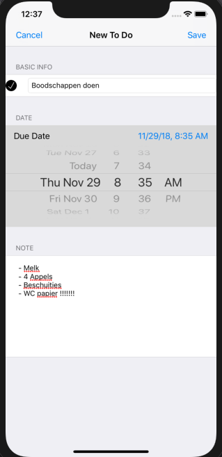

### To Do List

In de app kan je je huiswerk (of andere taken) bijhouden. Je kan een nieuwe taak aanmaken, een einddatum instellen en een korte notitie toevoeging. Deze taak verschijnt vervolgens in de lijst. In de lijst kan je door middel van de knop 'edit' taken verwijderen. 

